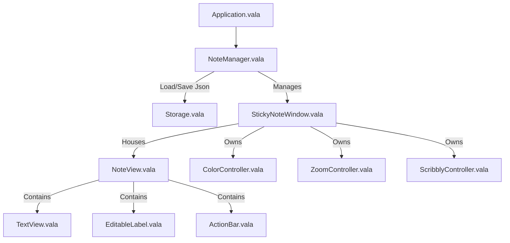

# Jots - Agent Development Guide

Welcome! This document serves as a comprehensive reference guide to Jots' codebase structure, internal architecture, core lifecycles, and development workflows to help you make changes quickly and safely.

---

## 🏗️ Architecture & High-Level Design

Jots is a lightweight, simple sticky notes application built for elementary OS and GNOME-based Linux distributions. It is written in **Vala** and uses **GTK 4** and **Granite 7**.

The application uses an object-oriented manager pattern:
1. **`Jots.Application`** is the main entry point that handles GSettings/GTK configurations and manages global actions.
2. **`Jots.NoteManager`** is the coordinator that manages window creation, deletion, restoration, and debounces writes to disk.
3. **`Jots.Storage`** performs the low-level JSON serialization and file operations to save note data on disk.
4. **`Jots.StickyNoteWindow`** represents individual sticky note windows, containing the editor widget, action menus, and individual controllers.



---

## 📂 Codebase File Structure

Here is a map of the primary files in the repository:

### 1. Root & Build Infrastructure
*   [`meson.build`](file:///home/dkorah/development/github.com/comicdeed/comicdeed-jots/meson.build): Main Meson project declaration containing versioning, flags, dependencies, and OS-specific setup.
*   [`io.github.comicdeed.jots.devel.yml`](file:///home/dkorah/development/github.com/comicdeed/comicdeed-jots/io.github.comicdeed.jots.devel.yml): Development Flatpak manifest.
*   [`Dockerfile`](file:///home/dkorah/development/github.com/comicdeed/comicdeed-jots/Dockerfile): Containerized development environment using Debian Sid.
*   [`devel.sh`](file:///home/dkorah/development/github.com/comicdeed/comicdeed-jots/devel.sh): Wrapper script to build the image, configure/compile, test, and run Jots within Docker.

### 2. Core Application Logic (`src/`)
*   [`Application.vala`](file:///home/dkorah/development/github.com/comicdeed/comicdeed-jots/src/Application.vala): Entry point. Configures DBus, theme changes (dark mode preferences), localization, and global keyboard shortcut accelerators.
*   [`Constants.vala`](file:///home/dkorah/development/github.com/comicdeed/comicdeed-jots/src/Constants.vala): Global settings keys, style class names, and defaults.

### 3. Objects & Models (`src/Objects/`)
*   [`NoteData.vala`](file:///home/dkorah/development/github.com/comicdeed/comicdeed-jots/src/Objects/NoteData.vala): Model representing the attributes of a single note. Implements serialization/deserialization to/from `Json.Object`.
*   [`Themes.vala`](file:///home/dkorah/development/github.com/comicdeed/comicdeed-jots/src/Objects/Themes.vala): Enum for colors (e.g. `BLUEBERRY`, `MINT`, `LIME`, etc.). Handles user-facing names and CSS class mappings.
*   [`Zoom.vala`](file:///home/dkorah/development/github.com/comicdeed/comicdeed-jots/src/Objects/Zoom.vala) & [`ZoomType.vala`](file:///home/dkorah/development/github.com/comicdeed/comicdeed-jots/src/Objects/ZoomType.vala): Zoom scale representations and level constants.

### 4. Services (`src/Services/`)
*   [`NoteManager.vala`](file:///home/dkorah/development/github.com/comicdeed/comicdeed-jots/src/Services/NoteManager.vala): Manages active window registry (`open_notes`). Handles saving trigger debouncing to prevent excessive disk writes during typing.
*   [`Storage.vala`](file:///home/dkorah/development/github.com/comicdeed/comicdeed-jots/src/Services/Storage.vala): Encapsulates JSON data loading and saving. Uses path `Environment.get_user_data_dir() + "/" + APP_ID + "/saved_state.json"`.
*   [`ColorController.vala`](file:///home/dkorah/development/github.com/comicdeed/comicdeed-jots/src/Services/ColorController.vala): Modifies GTK CSS classes on windows when the background color changes.
*   [`ZoomController.vala`](file:///home/dkorah/development/github.com/comicdeed/comicdeed-jots/src/Services/ZoomController.vala): Listens to keyboard shortcuts (`Ctrl` + scroll wheel/gestures) to alter note text size.
*   [`ScribblyController.vala`](file:///home/dkorah/development/github.com/comicdeed/comicdeed-jots/src/Services/ScribblyController.vala): Controls background text scribble visual effect when note windows lose focus.

### 5. Views & Windows (`src/Views/` & `src/Windows/`)
*   [`StickyNoteWindow.vala`](file:///home/dkorah/development/github.com/comicdeed/comicdeed-jots/src/Windows/StickyNoteWindow.vala): The main note window widget. Handles layout bindings, keyboard input hooks, and size state packing.
*   [`PreferenceWindow.vala`](file:///home/dkorah/development/github.com/comicdeed/comicdeed-jots/src/Windows/PreferenceWindow.vala): Application settings window.
*   [`NoteView.vala`](file:///home/dkorah/development/github.com/comicdeed/comicdeed-jots/src/Views/NoteView.vala): Layout box inside the Sticky Note containing the headerbar, body editor, and bottom action bar.
*   [`PreferencesView.vala`](file:///home/dkorah/development/github.com/comicdeed/comicdeed-jots/src/Views/PreferencesView.vala): Content inside the preference window containing toggle switches.

---

## 🔄 Core Lifecycles & Flows

### 1. Initialization Flow
When the application starts:
1. `Application.vala` initiates `Granite` and `Gtk` settings.
2. It instantiates `NoteManager.vala`, which in turn creates `Storage.vala`.
3. `NoteManager.init()` loads the note JSON array from disk.
4. If no JSON exists, a default blueberry note is created via `create_note()`. Otherwise, notes are read sequentially and instantiated as `StickyNoteWindow`s.

### 2. Auto-Saving Mechanism (Debounced)
To prevent stalling the UI thread on keystroke changes:
1. When text changes in `TextView` or the title updates in `EditableLabel`, `has_changed()` or `on_editable_changed()` is triggered.
2. They notify `NoteManager.save_all()`.
3. `NoteManager` clears any existing timeout timer and registers a new handler using a `Timeout.add` debounce delay (usually `DEBOUNCE` interval).
4. When the debounce timer triggers, `immediately_save()` queries all active `StickyNoteWindow`s for their serialized data via `packaged()`, formats them as a JSON array, and calls `Storage.save()`.

### 3. Deletion and Restoration
1. When a user deletes a note, `NoteManager.delete_note()` is invoked.
2. The note's properties are stored in `last_deleted` for restoration.
3. The restore action (`action_restore_last_deleted`) is enabled.
4. The window is removed from the active list, closed, and the remaining note list is saved immediately.
5. If the user invokes "Restore" (`Ctrl + R`), `restore_last_deleted()` creates a new note from the cached `last_deleted` data and disables the restore action.

---

## 📦 Flatpak-Based Development Workflow

If you are compiling Jots locally, you should use Flatpak's native compilation sandbox, which automatically downloads and bundles all GNOME and elementary OS dependencies.

### 1. Install Flatpak Builder (on Host)
If the native `flatpak-builder` package is not available on your host system, install the flatpak-builder utility image from Flathub:
```bash
flatpak install flathub org.flatpak.Builder
```

### 2. Compile and Install Jots
Build the application against the [`io.github.comicdeed.jots.devel.yml`](file:///home/dkorah/development/github.com/comicdeed/comicdeed-jots/io.github.comicdeed.jots.devel.yml) manifest. This compiles Jots and installs the development variant into your local user sandbox:
```bash
flatpak run org.flatpak.Builder --force-clean --sandbox --user --install --install-deps-from=flathub --ccache builddir io.github.comicdeed.jots.devel.yml
```

### 3. Run Jots
Run Jots natively on your host:
```bash
flatpak run io.github.comicdeed.jots.devel
```

---

## 💡 Guidelines for Future Modifications

*   **UI/UX Aesthetic Constraints:** Jots has a strict policy to stay minimal and simple. Avoid adding heavy components.
*   **Compilation Warnings:** The Vala compiler generates C code which can throw warnings during GCC compilation. The build uses the `-w` compiler argument in `executable(...)` to ignore Vala-generated C warning noise.
*   **Settings Schema:** If modifying preferences or settings, update the GSettings XML schema at [`data/io.github.comicdeed.jots.gschema.xml`](file:///home/dkorah/development/github.com/comicdeed/comicdeed-jots/data/io.github.comicdeed.jots.gschema.xml).

---

## 🧭 Pull Request & Integration Guardrails

To keep development frictionless, **these rules apply only when preparing a branch or Pull Request for upstream merge/review**. You are free to make arbitrary local modifications and experiment without these constraints during local development.

### 1. Issue and Pull Request Scoping
* **Issue First (Recommended)**: For non-trivial modifications, verify that an issue exists outlining the requirements. Keep issues concise and well-defined (less is more).
* **PR Focus**: Ensure the branch is focused on a single logical change. If the scope of the changes cannot be explained in a single short paragraph, break it down into smaller, sequential pull requests.
* **Cohesive Commit Breakdown**: Group changes into cohesive, single-purpose commits.

### 2. Manual Testing and User Attribution Verification
* **Ask About Testing**: Before pushing changes to an upstream PR branch, ask the user what manual testing has been performed (unless it is already evident from the context).
* **Verify Manual Commits**: Check the git history to identify any commits manually authored by the user, and ensure they are clearly credited in the Pull Request's human contributions section.

### 3. AI Commit Message Trailer
* To make tracking changes transparent, any commit generated by an AI assistant or agent should include a Co-authored-by trailer in the commit message referencing the agent tool used:
  ```
  Co-authored-by: <AgentName>-Agent <agent@<domain>>
  ```
  *(e.g., `Co-authored-by: Gemini-Agent <agent@gemini>` or `Co-authored-by: Copilot-Agent <agent@copilot>`)*
* **PR Description Requirement**: Automatically prepare the PR description draft to include the **Honest Attribution** markdown block (disclosing human contributions, AI tools, and AI contributions).

### 4. Human Oversight Reminder
* **Responsibility Callout**: Remind the human contributor that they are ultimately responsible for all submitted changes. Advise them to fully read the code, check for hallucinations, and run manual verification tests before approving the PR. Remind them to be in control of their tools!

