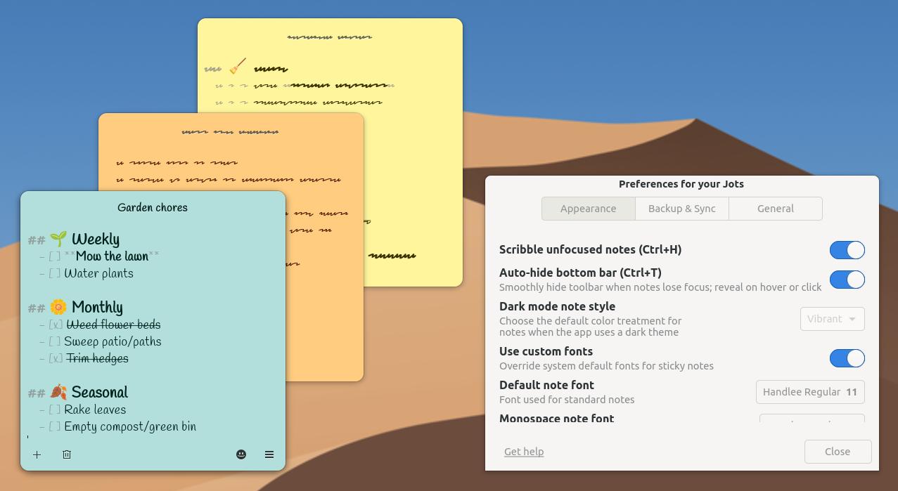
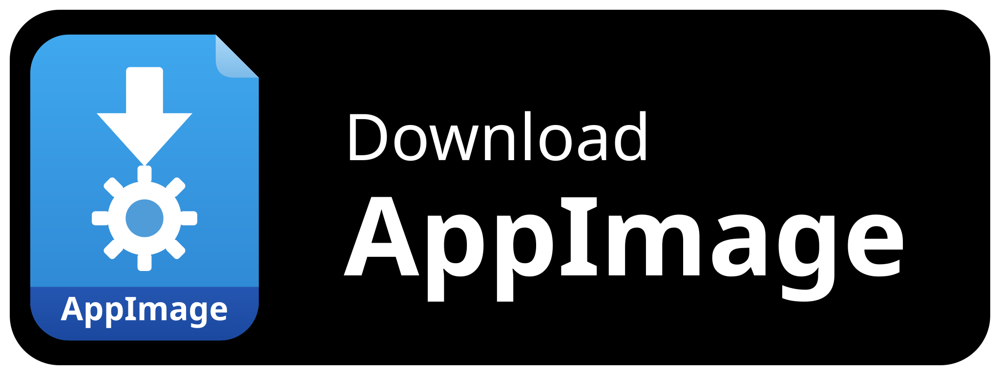

<div align="center">
  
  <h1>Jots</h1>
  <p>Lightweight sticky notes application for the Linux desktop.</p>
  
  <picture>
    <source media="(prefers-color-scheme: dark)" srcset="data/screenshots/jots-dark.png">
    <source media="(prefers-color-scheme: light)" srcset="data/screenshots/jots-light.png">
    
  </picture>
</div>

---

> 📖 **User Guide**: Refer to the **[Jots User Guide](docs/user-guide.md)** for a complete overview of note operations, keyboard shortcuts, formatting, and AI automation.

---

## Key features

* 📝 **Markdown editing + plain-file storage**: Write with live Markdown formatting, checklists, clickable links, and resilient smart clipboard paste that converts rich-text/HTML and normalizes loose Markdown while protecting code snippets. Notes are saved as standard `.md` files you can back up or use in other tools.
* 🎨 **Color themes**: Pick from 10 pastel themes that look good in both light and dark mode.
* 🔤 **Font controls**: Choose your preferred text and code fonts to match how you like to read and write.
* 🔒 **Privacy mode**: Hide note text when you need to protect sensitive content on screen.
* 🔁 **Git backup sync**: Connect a Git remote, choose how often to sync, and use **Sync now** when you want an immediate backup.
* 🤖 **AI-ready with MCP**: Connect compatible assistants (Claude Desktop, Cursor, Gemini CLI, Antigravity) to manage notes from AI tools.
* ⚡ **Fast and lightweight**: Starts quickly and stays responsive.

---

## Installation and quick start

Jots is currently Linux-first. AppImage and Flatpak are the supported distribution paths. Windows installers are currently not published in automated releases.

**Recommended (Primary Distribution):**

<a href="https://github.com/comicdeed/jots/releases/latest">
  
</a>

* **Linux AppImage (Recommended, Click-and-Run)**: Download `Jots-<version>-<arch>.AppImage` (currently `Jots-<version>-x86_64.AppImage` or `Jots-<version>-aarch64.AppImage`) from the [latest release](https://github.com/comicdeed/jots/releases/latest), make it executable (`chmod +x Jots-*.AppImage`), and run directly on any Linux distribution without installation.
* **Linux Flatpak (Alternative)**: Download `io.github.comicdeed.jots-<version>-x86_64.flatpak` from the [latest release](https://github.com/comicdeed/jots/releases/latest) and install with `flatpak install io.github.comicdeed.jots-*.flatpak`.
* **Local compilation**: Refer to the [Developer Setup Guide](docs/development/setup.md) or [Building Guide](docs/development/building.md) for compilation instructions.
* **Windows (Manual Build Only)**: Automated release installers are currently disabled. If you want official release installers re-enabled, open a request in the [Issues tab](https://github.com/comicdeed/jots/issues) with the `feature request` label. If you need Windows now, build locally using the [Windows Build Guide](docs/development/windows.md).

---

## AI assistant and MCP automation

Jots includes a native [Model Context Protocol (MCP)](https://modelcontextprotocol.io/) server (`jots-mcp`) allowing AI assistants (Claude Desktop, Cursor, Gemini CLI, and Antigravity) to query, create, edit, search, and delete sticky notes live on the desktop.

For setup, use the canonical **[MCP Integration Guide](docs/development/mcp-server.md#2-client-configuration-examples)**.

---

## Markdown storage and tool interoperability

All notes are stored as individual `.md` Markdown files with standardized YAML front-matter headers containing note metadata (note ID, title, theme, zoom, and window dimensions). Because notes are saved in plain text, you can read them with standard text tools, version control them with Git, or potentially integrate them into personal knowledge base directories (such as Obsidian or Logseq):

```markdown
---
id: "project-ideas~a1b2c3"
title: "Project Ideas"
theme: "MINT"
monospace: false
zoom: 100
width: 380
height: 320
---
# Architecture Overview
- [x] Switch to Markdown storage
- [x] Native MCP AI assistant integration
- [ ] Central Note Organizer library
```

### Storage paths
* **Flatpak sandbox**:
  `~/.var/app/io.github.comicdeed.jots/data/io.github.comicdeed.jots/notes/`
* **Native / system package**:
  `~/.local/share/io.github.comicdeed.jots/notes/`

---

## Documentation index

* **[User Guide](docs/user-guide.md)**: End-user documentation for note operations and shortcuts.
* **[System Architecture](docs/architecture.md)**: Component hierarchy, subsystem boundaries, and D-Bus IPC specifications.
* **[Product Roadmap](docs/roadmap.md)**: Graded backlog and development initiatives.
* **[MCP Integration Guide](docs/development/mcp-server.md)**: Setup instructions for AI assistant clients.
* **[Contributing and PR Guidelines](docs/development/pull-request-guidelines.md)**: Contribution checklist and pull request standards.

---

## Lineage and acknowledgements

Jots is an independent fork and modern evolution of [Jorts](https://github.com/elly-code/jorts) (originally [Notejot](https://github.com/lainsce/notejot) by [Lains](https://github.com/lainsce)).

We are deeply grateful to the original authors, upstream maintainers, and community contributors whose foundational work made Jots possible. For complete credits, see [Project Credits & Acknowledgements](docs/thanks.md).

---

## Community and support

* **Discussions**: Ask questions or discuss new features in the [GitHub Discussions tab](https://github.com/comicdeed/jots/discussions).
* **Issue tracker**: Report bugs or suggest enhancements via the [Issues tab](https://github.com/comicdeed/jots/issues).
