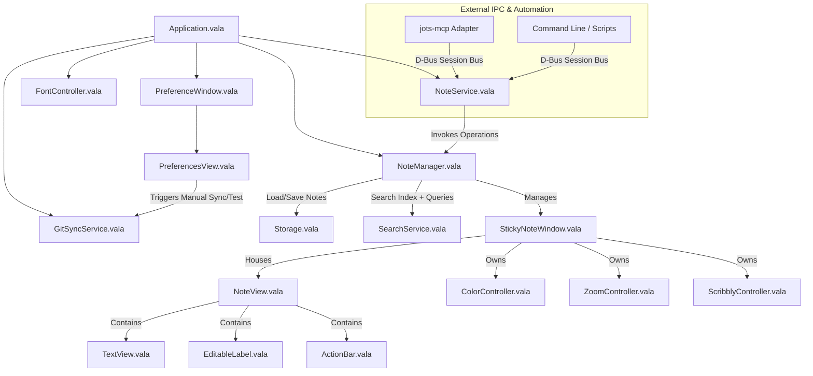
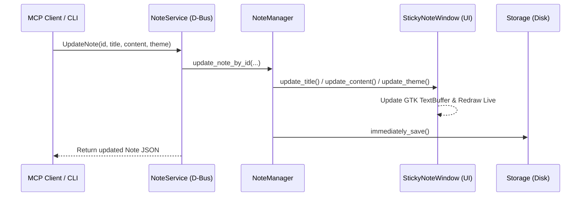

# Jots System Architecture

This document provides a comprehensive technical reference for the internal architecture, subsystem boundaries, IPC services, and data lifecycles of Jots.

---

## 1. System Overview & Component Hierarchy

Jots is a lightweight sticky notes application written in **Vala** with pure **GTK 4** and bundled GResource symbolic assets. Runtime behavior and packaging are Linux-first (GNOME, elementary OS, KDE Plasma, XFCE), with an experimental Windows build path.

---

## 2. Subsystem Boundaries

### 2.1 Core Application Layer (`src/`)
* **`Application.vala`**: Entry point (`Gtk.Application`). Handles localization, global keyboard accelerators, GSettings, system dark mode tracking, and registers the session bus D-Bus interface.
* **`Constants.vala`**: Central repository for application keys, layout dimensions, debounce intervals, and guardrail limits.

### 2.2 Domain Models (`src/Objects/`)
* **`NoteData.vala`**: In-memory data model for a sticky note. Encapsulates UUID (`id`), title, body content, theme enum, monospace toggle, zoom level, and window geometry. Handles serialization to/from JSON.
* **`Themes.vala`**: Enum representing the 10 pastel color themes, user-facing localized names, CSS class mappings, and random selection logic.
* **`Zoom.vala` & `ZoomType.vala`**: Zoom scale levels and step calculations.

### 2.3 Services & Coordination (`src/Services/`)
* **`NoteManager.vala`**: The central coordinator. Manages the active window registry (`open_notes`), creates and destroys windows, coordinates debounced auto-saving, and enforces active note ceilings (`MAX_ACTIVE_NOTES = 50`).
* **`NoteService.vala`**: Native D-Bus service exposing the `io.github.comicdeed.jots.Notes` interface on the session bus. Allows external processes (CLI, desktop scripts, MCP adapters) to query, create, edit, search, and delete notes live on the desktop.
* **`SearchService.vala`**: Provides in-memory plus storage-backed note search with relevance scoring and JSON-oriented result shaping used by `NoteManager` and D-Bus query paths.
* **`Storage.vala`**: Encapsulates disk persistence of individual Markdown files with YAML front matter (`~/.local/share/io.github.comicdeed.jots/notes/<id>.md`) and handles automatic legacy JSON migration. Completely insulated from external consumers by the D-Bus service boundary.
* **`MarkdownSerializer.vala`**: Lightweight YAML front matter parser and Markdown serializer for `NoteData`.
* **`MarkdownNormalizer.vala`**: Pure, stateless normalization pipeline for loose Markdown bullets, checklist glyphs, line endings, dedenting, and level-based marker harmonization.
* **`HtmlToMarkdown.vala`**: Pure, zero-dependency stream/token-based HTML to Markdown converter for rich-text clipboard payloads.
* **`GitSyncService.vala`**: Handles local Git backup commit orchestration, remote synchronization cadence, divergence detection, and sync status reporting through GSettings-backed state.
* **`ColorController.vala`**: Manages CSS theme class assignment on note windows.
* **`ZoomController.vala`**: Handles pinch gestures, `Ctrl` + scroll wheel, and zoom step key bindings.
* **`ScribblyController.vala`**: Controls the background text scribble aesthetic effect on unfocused notes.

### 2.4 UI & Widgets (`src/Views/`, `src/Windows/`, `src/Widgets/`)
* **`StickyNoteWindow.vala`**: Application window containing note controls and editor view. Provides programmatic update methods (`update_title`, `update_content`, `update_theme`) for real-time external synchronization.
* **`TextView.vala` & `MarkdownBuffer.vala`**: Native GTK4 `TextView` with clickable URI handling and real-time Markdown syntax tagging (Headings H1-H3, Bold, Italic, Strikethrough, Monospace inline code, Code blocks, Blockquotes, Checklists, and smart list continuation).
* **`ColorBox.vala` & `ColorPill.vala`**: Custom Cairo-drawn palette widgets rendering discrete circular pills with matching accent selection rings.
* **`PreferenceWindow.vala` & `PreferencesView.vala`**: Settings window for global user preferences.

### 2.5 Native MCP Server Binary (`src/Mcp/`)
* **`jots-mcp`**: Standalone CLI executable compiled alongside Jots in `meson.build`. Links only against `glib-2.0`, `gio-2.0`, and `json-glib-1.0` (zero GTK/display overhead, ~50 KB footprint, `< 2ms` startup). Implements line-delimited JSON-RPC 2.0 over `stdio` according to MCP specification `2024-11-05` and connects directly to `io.github.comicdeed.jots.Notes` on D-Bus. Bundled inside Flatpak at `/app/bin/jots-mcp`.

### 2.6 Shared Utilities (`src/Utils/`)
* **`Logger.vala`**: Thread-safe, zero-GTK leveled logger (`ERROR`, `WARN`, `INFO`, `DEBUG`, `TRACE`). Provides strict `stderr` stream isolation for CLI/MCP binaries, real-time request latency tracing, 4-tier cascading file rotation (`mcp.log` $\rightarrow$ `.1` $\rightarrow$ `.2` $\rightarrow$ `.3` at 5 MB), and runtime path configuration via `JOTS_LOG_LEVEL` and `JOTS_LOG_FILE`.
* **`PackagingContext.vala`**: Detection engine for packaging formats (AppImage, Flatpak, Native) and graphical display availability (`is_gui_available`).
* **`NoteIdentifier.vala`**: Canonical UUID validation and slug normalization.
* **`Autostart.vala`**: XDG and Portal autostart management.
* **`Random.vala`**: Cryptographically secure pseudorandom token and UUID generators.

---

## 3. Core Lifecycles & Sequence Flows

### 3.1 Application Initialization & Unified Identity Model
1. **Unified Identity Model**: Jots enforces a strict two-profile identity system: **Stable** (`io.github.comicdeed.jots`) and **Devel** (`io.github.comicdeed.jots.devel`). Packaging formats (Native, AppImage, Flatpak) share these exact Application IDs.
2. **Single-Instance Enforcement**: `Application.vala` inherits `Gtk.Application` without `NON_UNIQUE`. When launched, the process connects to the D-Bus session bus:
   - If the name is unowned, it acquires primary instance ownership, initializes services, and registers the `io.github.comicdeed.jots.Notes` interface.
   - If the name is already owned (e.g. an AppImage launched while a Native/Flatpak build is running), `GApplication` automatically sends a remote `Activate` D-Bus signal to present existing windows and terminates the secondary process cleanly with exit code 0.
3. `Application.vala` initializes `Gtk` settings, XDG Desktop Portal theme detection, and registers bundled GResource symbolic icon paths.
4. `NoteManager` and `NoteService` instances are initialized.
5. During D-Bus registration, `NoteService` binds to `/io/github/comicdeed/jots/Notes` and `/io/github/comicdeed/jots`.
6. On activation (or first D-Bus method call via `ensure_initialized()`), `NoteManager.init()` loads stored state from `Storage.vala`.
7. If no storage file exists, a default Blueberry note is spawned. Otherwise, saved notes are deserialized and presented.

### 3.2 Real-Time Mutation via D-Bus / MCP

### 3.3 Debounced Auto-Saving (Typing Flow)
1. Keystrokes in `TextView` or edits in `EditableLabel` trigger `has_changed()`.
2. `NoteManager.save_all()` is called, resetting the debounce timer (`DEBOUNCE = 900ms`).
3. When the debounce timer elapses, `immediately_save()` persists each active `StickyNoteWindow` individually via `Storage.save_note()` as Markdown with YAML front matter.

### 3.4 Deletion and Undo Recovery
1. User invokes `Ctrl+W` or clicks delete (or external tool calls `DeleteNote(id)`).
2. The note's state is cached in `NoteManager.last_deleted` and `Application.ACTION_RESTORE_LAST` is enabled.
3. The window is removed from `open_notes`, closed, and remaining notes are saved immediately.
4. User presses `Ctrl+R` to restore: `restore_last_deleted()` respawns the window from cached data.

### 3.5 Backup Remote State Matrix (`GitSyncService`)

`GitSyncService` uses remote fetch + branch resolution + local commit presence checks before push/pull decisions. The matrix below captures expected outcomes for first-time and mid-stream remote configuration.

| Scenario | Local Has Commits | Remote Has Commits | Branch Relation | Expected Status Outcome |
| :--- | :---: | :---: | :--- | :--- |
| A | No | No | Same branch | `Backup repository ready` |
| B | No | Yes | Same branch | `Remote changes detected; sync update needed` |
| C | No | Yes | Different branch name | `Remote changes detected; sync update needed` (remote content detected via any `origin/*` head) |
| D | Yes | No | Same branch | `Backup synchronized with remote repository` |
| E | Yes | Yes | Same branch, local ahead | `Backup synchronized with remote repository` |
| F | Yes | Yes | Same branch, local behind only | `Backup repository ready` (after pull/rebase path) |
| G | Yes | Yes | Same branch, histories diverged | `Remote changes detected; sync update needed` |

Implementation notes:

* Branch resolution first attempts `rev-parse --abbrev-ref HEAD`, then falls back to `symbolic-ref --short HEAD` for unborn branch states.
* When local history is empty, remote presence is detected from any fetched `origin/*` branch head (excluding `origin/HEAD`) to support both `main` and `master` conventions.
* Divergence remains a guarded state and does not auto-force merge conflicting histories.
* Git command execution assumes `git` is available on `PATH`; Windows builds currently rely on host-level Git installation for backup/sync.

### 3.6 MCP Server Lifecycle & Process-Isolated Auto-Spawn
1. **Stateless Operations**: `initialize`, `ping`, `tools/list`, `prompts/list`, and static resources (`jots://instructions`, `jots://formatting-guide`) run completely statelessly without querying D-Bus or touching display dependencies.
2. **On-Demand Auto-Spawn**: When `jots-mcp` receives an action tool call (`tools/call`) or live state query while the desktop application is closed:
   - Probes D-Bus with `DO_NOT_AUTO_START` (0ms).
   - If unowned, invokes `Process.spawn_async` with `STDOUT_TO_DEV_NULL | STDERR_TO_DEV_NULL` to launch the background GUI without polluting JSON-RPC stdout.
   - Polls session bus registration asynchronously at 25ms intervals (connecting within ~150ms).
   - Intentionally bypasses system D-Bus activation (`try_connect_dbus(true)`) to prevent 25-second activation timeout penalties on portable AppImage environments.
3. **Flatpak Sandbox Isolation**: In Flatpak environments, `can_auto_spawn()` respects container boundaries by connecting to the session bus directly or returning clear manual launch instructions.

---

## 4. Guardrails & Performance Constraints

Preference and information architecture decisions follow the canonical UI and UX guidance in [docs/development/ui-ux-guidelines.md](development/ui-ux-guidelines.md).

| Constraint | Limit | Rationale |
| :--- | :---: | :--- |
| **Max Note Content** | `10,000` chars (~10 KB) | Maintains sub-millisecond regex scanning in `MarkdownBuffer` and prevents UI frame hitching. |
| **Max Note Title** | `120` chars | Prevents header bar overflow and geometry distortion. |
| **Max Active Notes** | `50` notes | Prevents window spam and desktop compositor texture exhaustion. |
| **Max Search Results** | `20` matches | Capped with snippets to prevent LLM context token blowout. |
