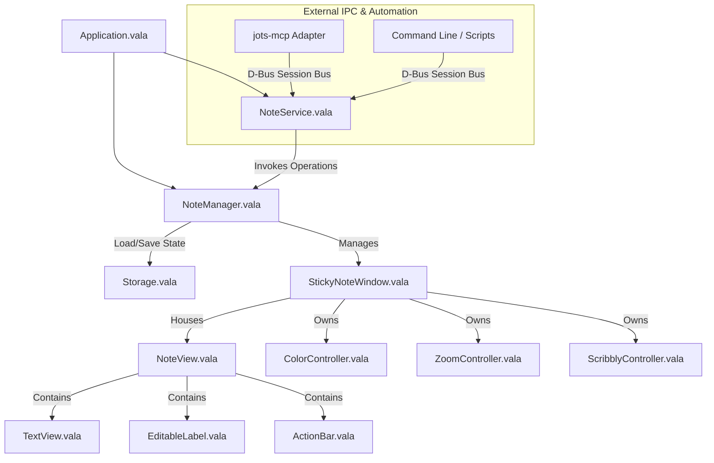
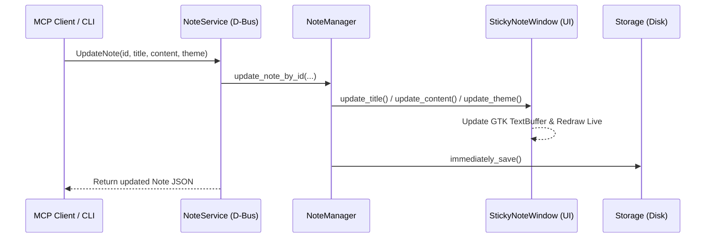

# Jots System Architecture

This document provides a comprehensive technical reference for the internal architecture, subsystem boundaries, IPC services, and data lifecycles of Jots.

---

## 1. System Overview & Component Hierarchy

Jots is a lightweight sticky notes application built for elementary OS and GNOME-based Linux distributions. It is written in **Vala** and uses **GTK 4** and **Granite 7**.

---

## 2. Subsystem Boundaries

### 2.1 Core Application Layer (`src/`)
* **`Application.vala`**: Entry point (`Gtk.Application`). Handles localization, global keyboard accelerators, GSettings, system dark mode tracking, and registers the session bus D-Bus interface.
* **`Constants.vala`**: Central repository for application keys, layout dimensions, debounce intervals, and guardrail limits.

### 2.2 Domain Models (`src/Objects/`)
* **`NoteData.vala`**: In-memory data model for a sticky note. Encapsulates UUID (`id`), title, body content, theme enum, monospace toggle, zoom level, and window geometry. Handles serialization to/from JSON.
* **`Themes.vala`**: Enum representing the 10 pastel color themes, user-facing localized names, CSS class mappings, and random selection logic.
* **`Zoom.vala` & `ZoomType.vala`**: Zoom scale levels and step calculations.

### 2.3 Services & Coordination (`src/Services/`)
* **`NoteManager.vala`**: The central coordinator. Manages the active window registry (`open_notes`), creates and destroys windows, coordinates debounced auto-saving, and enforces active note ceilings (`MAX_ACTIVE_NOTES = 50`).
* **`NoteService.vala`**: Native D-Bus service exposing the `io.github.comicdeed.jots.Notes` interface on the session bus. Allows external processes (CLI, desktop scripts, MCP adapters) to query, create, edit, search, and delete notes live on the desktop.
* **`Storage.vala`**: Encapsulates disk persistence (`~/.local/share/io.github.comicdeed.jots/saved_state.json`). Completely insulated from external consumers by the D-Bus service boundary.
* **`ColorController.vala`**: Manages CSS theme class assignment on note windows.
* **`ZoomController.vala`**: Handles pinch gestures, `Ctrl` + scroll wheel, and zoom step key bindings.
* **`ScribblyController.vala`**: Controls the background text scribble aesthetic effect on unfocused notes.

### 2.4 UI & Widgets (`src/Views/`, `src/Windows/`, `src/Widgets/`)
* **`StickyNoteWindow.vala`**: Application window containing note controls and editor view. Provides programmatic update methods (`update_title`, `update_content`, `update_theme`) for real-time external synchronization.
* **`NoteView.vala`**: Layout container housing the title bar, `EditableLabel`, `TextView`, and `ActionBar`.
* **`TextView.vala` & `TextBuffer.vala`**: Subclassed `Granite.HyperTextView` with URL/email detection and custom hanging bullet list indentation.
* **`PreferenceWindow.vala` & `PreferencesView.vala`**: Settings window for global user preferences.

### 2.5 Protocol Adapters (`mcp-server/`)
* **`jots-mcp`**: Standalone Python package leveraging the official `mcp` SDK (`MCPServer`) and `dbus-fast`. Exposes standard MCP tools, resources (`jots://notes/{id}`), and prompts by translating JSON-RPC requests into calls against the native `io.github.comicdeed.jots.Notes` D-Bus service.

---

## 3. Core Lifecycles & Sequence Flows

### 3.1 Application Initialization
1. `Application.vala` initiates `Granite` and `Gtk` settings.
2. `NoteManager` and `NoteService` instances are initialized.
3. During D-Bus registration, `NoteService` binds to `/io/github/comicdeed/jots/Notes` and `/io/github/comicdeed/jots`.
4. On activation (or first D-Bus method call via `ensure_initialized()`), `NoteManager.init()` loads stored state from `Storage.vala`.
5. If no storage file exists, a default Blueberry note is spawned. Otherwise, saved notes are deserialized and presented.

### 3.2 Real-Time Mutation via D-Bus / MCP

### 3.3 Debounced Auto-Saving (Typing Flow)
1. Keystrokes in `TextView` or edits in `EditableLabel` trigger `has_changed()`.
2. `NoteManager.save_all()` is called, resetting the debounce timer (`DEBOUNCE = 900ms`).
3. When the debounce timer elapses, `immediately_save()` packages all active `StickyNoteWindow`s into a JSON array and writes to disk atomically.

### 3.4 Deletion and Undo Recovery
1. User invokes `Ctrl+W` or clicks delete (or external tool calls `DeleteNote(id)`).
2. The note's state is cached in `NoteManager.last_deleted` and `Application.ACTION_RESTORE_LAST` is enabled.
3. The window is removed from `open_notes`, closed, and remaining notes are saved immediately.
4. User presses `Ctrl+R` to restore: `restore_last_deleted()` respawns the window from cached data.

---

## 4. Guardrails & Performance Constraints

| Constraint | Limit | Rationale |
| :--- | :---: | :--- |
| **Max Note Content** | `10,000` chars (~10 KB) | Maintains sub-millisecond regex scanning in `Granite.HyperTextView` and prevents UI frame hitching. |
| **Max Note Title** | `120` chars | Prevents header bar overflow and geometry distortion. |
| **Max Active Notes** | `50` notes | Prevents window spam and desktop compositor texture exhaustion. |
| **Max Search Results** | `20` matches | Capped with snippets to prevent LLM context token blowout. |
