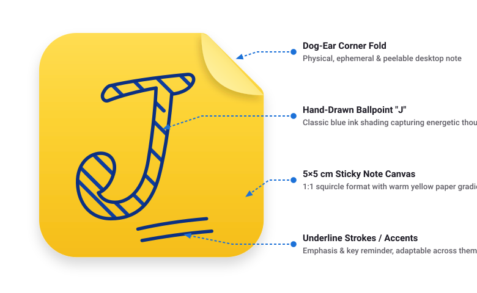

# Icon Design and Identity

Visual identity, design philosophy, and symbolic anatomy of the Jots application icon.

---

## 1. Design Philosophy

The Jots icon captures the universal experience of physical desktop note-taking: **the simplicity of quickly jotting down an unpolished thought, fleeting idea, or important reminder before it slips away.**

Rather than complex structured databases or multi-pane productivity tools, Jots preserves the tactile clarity of a 5×5 cm sticky note and a ballpoint pen. The icon conveys this direct, analog feeling through digital craft.

---

## 2. Visual Anatomy and Symbolism

<picture>
  <source media="(prefers-color-scheme: dark)" srcset="../anatomy-diagram-dark.svg">
  <source media="(prefers-color-scheme: light)" srcset="../anatomy-diagram-light.svg">
  
</picture>

### A. The 5×5 cm Sticky Note Pad
* **Proportions and Geometry**: Symmetrical 1:1 squircle format aligned with desktop icon guidelines.
* **Warm Yellow Paper**: Natural sticky note yellow (`#FFDD53` to `#F5BD19`) with soft ambient drop shadows.
* **The Dog-Ear Fold**: A folded top-right corner with a lighter paper underside (`#FFF5B8` to `#E5BE30`) and cast shadow, reinforcing that notes are dynamic, peelable, and temporary.

### B. The Hand-Drawn Ballpoint "J"
* **Classic Blue Pen Ink**: Rendered in timeless ballpoint pen blue tones (`#0E3D9E`, `#0B3082`, and `#09266B`).
* **Hand-Sketched Outlines**: Freehand contours with natural pen pressure variation instead of rigid mechanical geometry.
* **Dense Cross-Hatching**: Filled with overlapping, multi-angle diagonal ballpoint sketch strokes, capturing the familiar physical habit of casually shading or bolding a letter while thinking.

### C. Double Underline Strokes
* **Emphasis**: Two quick, hand-drawn pen strokes placed beneath the letter `J` using the same pen line weight.
* **Significance**: Represents underlining a key action item, deadline, or important reminder.

---

## 3. Thematic Variations & Build Variants

All icon variants preserve the minimal two-tone paper + pen aesthetic:

* **Default (`default`)**: Warm yellow sticky note (`#FFDD53`), classic ballpoint blue `J`, and double underline strokes.
* **Development (`devel`)**: Pale yellow paper (`#FFF5C0`) with an integrated yellow and black diagonal hazard stripe footer along the bottom edge, and hand-drawn developer code brackets (`</ >`) positioned cleanly in the note body.
* **Halloween (`halloween`)**: Spooky pumpkin orange paper (`#FF841A`) with midnight ink (`#1C1626`), classic hand-drawn spooky ghost, and a playful `BOO!` callout.
* **Pride (`pride`)**: Cream paper (`#FFFBF0`) with classic ballpoint blue ink and three tilted, deeply curved concentric upward rainbow arches across all resolutions.
* **Classic (`classic`)**: Warm vintage kraft paper (`#EEDB9F`) with deep charcoal/sepia ink (`#29221C`).

---

## 4. Multi-Size Scalability & Pixel-Fitting

* **`128px` & `scalable.svg`**: High-density multi-angle ballpoint hatching + soft paper drop shadows.
* **`48px` & `64px`**: Medium-density clean parallel hatching (`12` lines) + crisp outlines.
* **`16px` & `24px`**: Solid bold hand-drawn silhouette with pixel-fitted strokes for maximum legibility on small desktop bars.

---

## 5. Asset References

* **Master Vector Concept**: [`data/icons/concept/jots-icon.svg`](../../data/icons/concept/jots-icon.svg) (512×512 master SVG).
* **Generation Engine**: [`scripts/generate_icons.py`](../../scripts/generate_icons.py) & [`scripts/render_pngs.py`](../../scripts/render_pngs.py).
* **Visual Catalogue**: [`docs/gallery.md`](../gallery.md).
