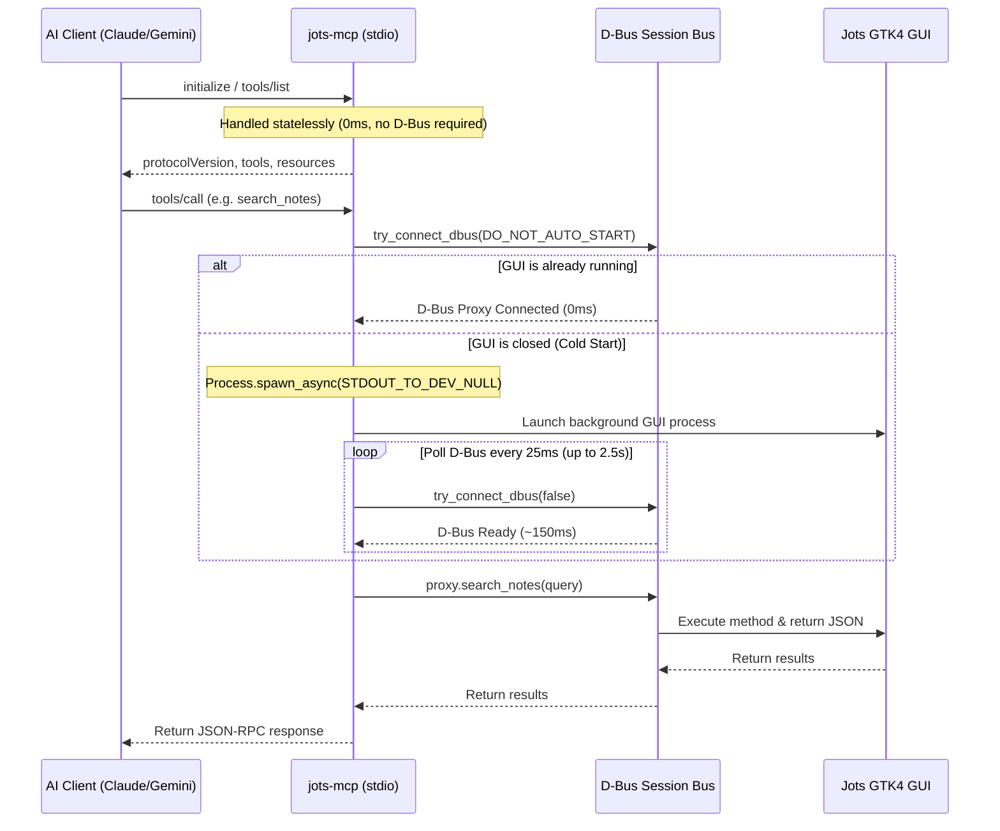

# Jots MCP Server Development & Integration Guide

The Model Context Protocol (MCP) server for Jots enables direct, native integration between desktop sticky notes and AI coding assistants (Claude Desktop, Cursor, Gemini CLI, Antigravity, Windsurf, and custom agents).

---

## 1. Architecture Overview

```mermaid
graph LR
    subgraph AI Client
        Claude[Claude Code / Desktop]
        Cursor[Cursor / Windsurf]
        Gemini[Antigravity / Gemini CLI]
    end

    subgraph MCP Transport Layer
        Stdio[jots-mcp (stdio JSON-RPC 2.0)]
    end

    subgraph Desktop Session
        DBus[(D-Bus Session Bus)]
        JotsApp[Jots GTK4 Application]
        Storage[(Local Markdown Files)]
    end

    Claude <-->|stdio JSON-RPC| Stdio
    Cursor <-->|stdio JSON-RPC| Stdio
    Gemini <-->|stdio JSON-RPC| Stdio

    Stdio <-->|io.github.comicdeed.jots.Notes| DBus
    DBus <--> JotsApp
    JotsApp <--> Storage
```

* **Standalone Binary**: `jots-mcp` is a lightweight standalone C/Vala executable that links only against `glib-2.0`, `gio-2.0`, and `json-glib-1.0`. It starts in `< 2ms` with zero GTK4/display overhead.
* **Direct IPC**: Communicates with the active Jots desktop application via the native `io.github.comicdeed.jots.Notes` D-Bus interface on the session bus.
* **Protocol Compliance**: Implements MCP specification `2024-11-05` over `stdio` with line-delimited JSON-RPC 2.0.

---

## 2. Setup & Client Configuration

### Claude Code CLI
Add to `~/.claude/settings.json` (or `~/.config/claude-code/config.json`) to register tools with automatic pre-approval:
```json
{
  "permissions": {
    "allow": [
      "mcp__jots__search_notes",
      "mcp__jots__read_note",
      "mcp__jots__create_note",
      "mcp__jots__update_note",
      "mcp__jots__list_notes",
      "mcp__jots__delete_note"
    ]
  }
}
```
Register the MCP server via `claude mcp add`:
```bash
claude mcp add jots -- /home/yourusername/Applications/jots.appimage --mcp
```

### Claude Desktop
Add to `~/.config/Claude/claude_desktop_config.json` (Linux):
```json
{
  "mcpServers": {
    "jots": {
      "command": "/home/yourusername/Applications/jots.appimage",
      "args": ["--mcp"]
    }
  }
}
```

### Cursor & Windsurf
Add to `.cursor/mcp.json` or `~/.codeium/windsurf/mcp_config.json`:
```json
{
  "mcpServers": {
    "jots": {
      "command": "/home/yourusername/Applications/jots.appimage",
      "args": ["--mcp"]
    }
  }
}
```

### Flatpak Standalone
When running inside Flatpak:
```json
{
  "mcpServers": {
    "jots": {
      "command": "flatpak",
      "args": ["run", "--command=jots-mcp", "io.github.comicdeed.jots"]
    }
  }
}
```

### Antigravity CLI (Tier 2 / Experimental)
Antigravity uses an orchestrator-subagent model. To enable Jots MCP:

1. **Plugin Manifest & Server Config**:
   Create `~/.gemini/config/plugins/jots/plugin.json`:
   ```json
   {
     "name": "jots",
     "version": "1.3.0",
     "description": "Jots Desktop Sticky Notes & MCP Integration"
   }
   ```
   Create `~/.gemini/config/plugins/jots/mcp_config.json`:
   ```json
   {
     "mcpServers": {
       "jots": {
         "command": "/home/yourusername/Applications/jots.appimage",
         "args": ["--mcp"]
       }
     }
   }
   ```

2. **Pre-Approve Tool Permissions**:
   Add to `~/.gemini/antigravity-cli/settings.json` under `permissions.allow` to bypass interactive subagent approval popups:
   ```json
   {
     "permissions": {
       "allow": [
         "mcp(*)",
         "mcp(jots)",
         "tool(CallMcpTool)",
         "tool(call_mcp_tool)"
       ]
     }
   }
   ```

3. **Subagent Invocation Caveat**:
   Root agents must define subagents with `enable_mcp_tools: true` (e.g. `define_subagent(name: "jots_agent", ..., enable_mcp_tools: true)`) before invoking them.

---

## 3. Available Tools

| Tool | Parameters | Description |
| :--- | :--- | :--- |
| `list_notes` | *(None)* | Returns JSON array of all active sticky notes with metadata and body length. |
| `create_note` | `title` (str), `content` (str), `theme` (str) | Creates and spawns a new sticky note window live on the desktop. |
| `read_note` | `id` (str, required) | Reads the full Markdown content, title, theme, and geometry of a note by UUID. |
| `update_note` | `id` (str, required), `title` (str), `content` (str), `theme` (str) | Updates an existing note's content or properties in real time. |
| `delete_note` | `id` (str, required) | Closes and deletes a sticky note window from the desktop. |
| `search_notes` | `query` (str, max 120) | Searches note titles and contents case-insensitively with relevance scoring. |

---

## 4. Available Resources & Prompts

| Resource URI | Description |
| :--- | :--- |
| `jots://instructions` | Comprehensive AI agent companion playbook, recipes, deduplication rules, and theme palette. |
| `jots://formatting-guide` | Markdown syntax, live checklist rules, and typography reference. |
| `jots://notes` | Live text dump of all open desktop sticky notes. |

### AI Companion Skill Guide
For AI agents (Cursor, Antigravity, Claude Code, Gemini CLI, Windsurf), install the universal companion skill:
```text
Install the jots-companion skill as a personal skill for yourself from https://raw.githubusercontent.com/comicdeed/jots/main/docs/mcp-skill.md
```
*(See [`docs/mcp-skill.md`](../mcp-skill.md) for full guide).*

---

## 5. Guardrails & Limits

| Guardrail | Limit | Behavior |
| :--- | :--- | :--- |
| **Max Note Content** | `10,000` chars (~10 KB) | Rejects over-length text to protect GTK text buffer rendering performance. |
| **Max Note Title** | `120` chars | Prevents header bar overflow. |
| **Active Notes Ceiling** | `50` notes | Prevents desktop window spam and texture exhaustion. |
| **Search Results** | `20` matches | Caps search results to prevent LLM context token inflation. |

---

## 6. Proactive Auto-Launch & Activation Architecture

`jots-mcp` implements a multi-tier, latency-optimized lifecycle model designed to keep tool operations instant, safe, and decoupled from display process lifecycles.



### 6.1 Stateless Discovery Tier (0ms Latency)
* Handshake methods (`initialize`, `notifications/initialized`, `ping`, `tools/list`, `prompts/list`, and static resources `jots://instructions`, `jots://formatting-guide`) execute **completely statelessly**.
* No D-Bus calls are made, no GUI processes are spawned, and no background dependencies are queried during client startup and tool discovery.

### 6.2 Process-Isolated Auto-Spawn Tier (AppImage / Native)
When an action request (`tools/call` or dynamic `resources/read` for `jots://notes`) arrives while Jots is closed:
1. **Immediate Probe**: Probes the session bus with `DBusProxyFlags.DO_NOT_AUTO_START` (0ms).
2. **File-Descriptor Isolated Spawning**: If unowned, `jots-mcp` launches the GUI in the background using `Process.spawn_async` with `SpawnFlags.STDOUT_TO_DEV_NULL | SpawnFlags.STDERR_TO_DEV_NULL`.
   - **JSON-RPC Stream Protection**: Isolating standard file descriptors guarantees that Mesa, GTK, or display server startup logs never leak into the parent MCP stdout stream.
3. **High-Frequency Async Polling**: Polls for D-Bus registration at **25ms intervals** up to 2.5s. Connection typically establishes within **150–175ms**.
4. **Bypassing System D-Bus Activation**: `jots-mcp` intentionally does not invoke `try_connect_dbus(true)` (system activation). Because portable AppImages do not install system `.service` files, bypassing system activation avoids the D-Bus daemon's 25-second activation timeout penalty.

### 6.3 Flatpak Sandbox Tier
* Inside Flatpak (`flatpak run --command=jots-mcp io.github.comicdeed.jots`), container security boundaries prevent spawning arbitrary background GUI processes.
* `jots-mcp` connects instantly to the running session bus or returns actionable manual launch guidance (`"Run: flatpak run io.github.comicdeed.jots"`) without blocking.

### 6.4 Headless Environment Detection
* If neither Wayland (`$WAYLAND_DISPLAY`) nor X11 (`$DISPLAY`) is present, GUI auto-spawning is cleanly bypassed, emitting a diagnostic explaining that an active graphical session is required.

---

## 7. Logging, Tracing & Diagnostics

`jots-mcp` includes an integrated, zero-GTK leveled logger (`Jots.Logger`) designed for real-time observability without breaking stdio protocol stream isolation.

### 7.1 Stream Isolation & File Logging
* **`stdout`**: Reserved exclusively for MCP JSON-RPC 2.0 frames.
* **`stderr`**: Receives formatted, timestamped log messages (`[YYYY-MM-DD HH:MM:SS.mmm] [LEVEL] [jots-mcp] message`).
* **Disk File**: Automatically appends to `~/.cache/jots/mcp.log` (or `~/.var/app/io.github.comicdeed.jots/cache/jots/mcp.log` in Flatpak) on every session.

### 7.2 Log Levels & Configuration
The server supports five log levels (`ERROR`, `WARN`, `INFO`, `DEBUG`, `TRACE`), defaulting to `INFO`:

| Level | Value | Captured Events |
| :--- | :---: | :--- |
| **`ERROR`** | `1` | Fatal crashes, uncaught exceptions, D-Bus proxy unrecoverable failures. |
| **`WARN`** | `2` | D-Bus disconnection, auto-spawn failures, tool errors, headless warnings. |
| **`INFO`** | `3` | *(Default)* Server startup, D-Bus connection, incoming tool calls, execution latency. |
| **`DEBUG`** | `4` | Detailed JSON payloads, query normalization, regex pattern matches. |
| **`TRACE`** | `5` | Raw wire RPC strings, lock lifecycle, full parser state dumps. |

#### Setting the Log Level
1. **Environment Variable**:
   ```bash
   JOTS_LOG_LEVEL=debug /path/to/jots.appimage --mcp
   ```
2. **CLI Flags**:
   ```bash
   /path/to/jots.appimage --mcp --debug
   /path/to/jots.appimage --mcp --trace
   ```
3. **Client Configuration (`claude_desktop_config.json` / `settings.json`)**:
   ```json
   {
     "mcpServers": {
       "jots": {
         "command": "/path/to/jots.appimage",
         "args": ["--mcp"],
         "env": {
           "JOTS_LOG_LEVEL": "debug"
         }
       }
     }
   }
   ```

### 7.3 Custom Log Path Override
To redirect log output to an alternative path:
```bash
JOTS_LOG_FILE=/tmp/custom-mcp.log /path/to/jots.appimage --mcp
```

### 7.4 Log Rotation & Retention
To prevent unbounded disk usage:
* When `mcp.log` reaches **5 MB**, it automatically rotates using a 3-generation cascading shift (`mcp.log` $\rightarrow$ `.1` $\rightarrow$ `.2` $\rightarrow$ `.3`).
* Total disk storage is capped at **~20 MB**.
* `~/.cache/jots/mcp.log` **always** holds the live, active latest lines.

### 7.5 Live Log Inspection
To monitor MCP interactions in real time while using Claude Code, Cursor, or Antigravity:
```bash
tail -f ~/.cache/jots/mcp.log
```
Sample log output:
```text
[2026-09-01 21:44:33.488] [INFO] [jots-mcp] Server initialized (version 1.3.0)
[2026-09-01 21:44:33.491] [INFO] [jots-mcp] Connected to D-Bus service at io.github.comicdeed.jots (/io/github/comicdeed/jots/Notes)
[2026-09-01 21:44:33.491] [INFO] [jots-mcp] -> tools/call: search_notes
[2026-09-01 21:44:33.493] [INFO] [jots-mcp] <- tools/call: search_notes OK (2ms)
```
