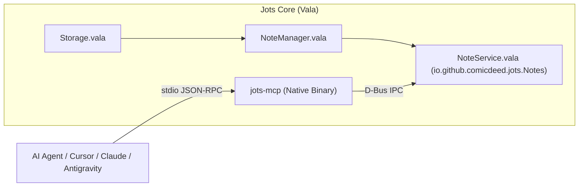

# Jots MCP Server Setup & Integration Guide

This guide explains how to connect Model Context Protocol (MCP) clients (such as Claude Desktop, Cursor, Gemini CLI, and Antigravity) to Jots for real-time sticky note automation.

---

## 1. Architecture Overview



- **Transport**: Standard input/output (`stdio`) JSON-RPC 2.0.
- **Native IPC**: Native D-Bus session bus communication with the running Jots application (`io.github.comicdeed.jots.Notes` / `io.github.comicdeed.jots`, with `io.github.comicdeed.jots.devel` in development builds).
- **Encapsulation**: Strict D-Bus boundary; storage internals remain completely private to Jots.
- **Binary Footprint**: ~50 KB native executable, `< 2ms` startup, zero Python runtime dependencies.

---

## 2. Client Configuration Examples

### AppImage Installation (Recommended for Release Builds)
Add the following to your AI client configuration (e.g. `~/.config/Claude/claude_desktop_config.json`, `.cursor/mcp.json`, or Antigravity settings):

```json
{
  "mcpServers": {
    "jots": {
      "command": "/path/to/Jots-<version>-<arch>.AppImage",
      "args": ["--mcp"]
    }
  }
}
```

### Flatpak Installation (Alternative)
Add the following to your AI client configuration (e.g. `~/.config/Claude/claude_desktop_config.json`, `.cursor/mcp.json`, or Antigravity settings):

```json
{
  "mcpServers": {
    "jots": {
      "command": "flatpak",
      "args": [
        "run",
        "--command=jots-mcp",
        "io.github.comicdeed.jots"
      ]
    }
  }
}
```

### Native Host Binary Installation
If Jots is installed natively from source or `.deb`/RPM package:

```json
{
  "mcpServers": {
    "jots": {
      "command": "jots-mcp"
    }
  }
}
```

### Antigravity / Gemini CLI
Run directly via AppImage, Flatpak, or native binary:

```bash
/path/to/Jots-<version>-<arch>.AppImage --mcp
```

```bash
flatpak run --command=jots-mcp io.github.comicdeed.jots
```

```bash
jots-mcp
```

---

## 3. Available Tools

| Tool | Parameters | Description |
| :--- | :--- | :--- |
| `list_notes` | None | Lists all active sticky notes with title, ID, theme, and length. |
| `read_note` | `id` (string) | Returns complete note text and properties. |
| `create_note` | `title` (str, max 120), `content` (str, max 10000), `theme` (str) | Spawns a new sticky note window on the desktop. |
| `update_note` | `id` (str), `title` (opt), `content` (opt), `theme` (opt) | Updates live note window and persists changes. |
| `delete_note` | `id` (string) | Closes and deletes the target sticky note. |
| `search_notes` | `query` (str, max 120) | Searches note titles and contents case-insensitively. |

---

## 4. Guardrails & Limits

| Guardrail | Limit | Behavior |
| :--- | :--- | :--- |
| **Max Note Content** | `10,000` chars (~10 KB) | Rejects over-length text to protect GTK text buffer rendering performance. |
| **Max Note Title** | `120` chars | Prevents header bar overflow. |
| **Active Notes Ceiling** | `50` notes | Prevents desktop window spam and texture exhaustion. |
| **Search Results** | `20` matches | Caps search results to prevent LLM context token inflation. |
