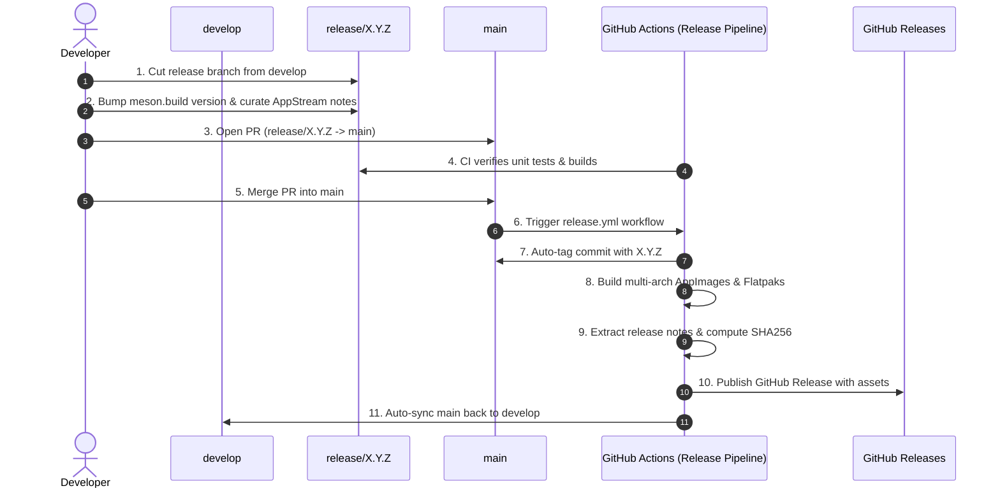

# Release Workflow & Automation Guide

Comprehensive guide to release branches, changelog curation, and automated multi-architecture releases for **Jots** (`io.github.comicdeed.jots`).

---

## 🧭 Overview & Branching Strategy

Jots follows a structured GitFlow branching model:

* **`main`**: Protected production branch containing verified **Stable releases**.
* **`develop`**: Primary integration branch where `feat/*` and `fix/*` PRs land.
* **`release/X.Y.Z[-beta.N]`**: Short-lived preparation branch cut from `develop`.



---

## 🛠️ Step-by-Step Release Procedure

### 1. Cut the Release Branch
Cut a new release branch from an up-to-date `develop`:
```bash
git checkout develop
git pull origin develop
git checkout -b release/1.0.0-beta.1   # For beta
# or
git checkout -b release/1.0.0          # For stable
```

### 2. Bump Version in `meson.build`
Update the version string in `meson.build`:
```meson
project(
    'io.github.comicdeed.jots',
    'vala', 'c',
    version: '1.0.0-beta.1',
    meson_version: '>= 0.59.0'
)
```

### 3. Curate Release Notes via Skill
Execute the project release notes skill (`.agents/skills/release-notes/SKILL.md`):

1. **Review commits**:
   ```bash
   # For beta:
   git log $(git describe --tags --abbrev=0)..HEAD --oneline --no-merges # incremental delta
   git log $(git tag --sort=-creatordate | grep -v -E '(beta|alpha|rc)' | head -n 1)..HEAD --oneline --no-merges # cumulative since last major

   # For stable:
   git log $(git tag --sort=-creatordate | grep -v -E '(beta|alpha|rc)' | head -n 1)..HEAD --oneline --no-merges
   ```
2. **Add `<release>` block** to `data/jots.metainfo.xml.in.in`:
   ```xml
   <releases>
       <release version="1.3.0-beta.6" type="development" date="2026-08-31">
           <description>
               <p>Jots 1.3.0 introduces automated Git backup &amp; remote sync, resilient smart clipboard paste, redesigned preferences, and window lifecycle stability.</p>
               <p>Highlights (✨ indicates new in this beta):</p>
               <ul>
                   <li>✨ Smart Paste automatically converts rich text and HTML from browsers and documents into clean Markdown.</li>
                   <li>✨ Loose Markdown normalization automatically aligns messy indentation, nested lists, and Unicode checkbox glyphs.</li>
                   <li>✨ Context-aware code protection ensures code snippets pasted inside backticks remain 100% untouched.</li>
                   <li>✨ Transient feedback banner notifies you when pasted text was formatted, with single-stroke Ctrl+Z undo and Ctrl+Shift+V raw paste bypass.</li>
                   <li>✨ Updated built-in Cheat Sheet (F1) with all modern keyboard shortcuts.</li>
                   <li>Automated Git backup and sync keeps notes mirrored to remote repositories with background debouncing.</li>
                   <li>Redesigned Preferences dialog with dedicated General, Theme &amp; Fonts, and Backup &amp; Sync tabs.</li>
                   <li>Universal desktop autostart with packaging-aware execution detection across AppImage and Flatpak.</li>
                   <li>Window destruction and note closing are hardened against lifecycle crashes.</li>
                   <li>Desktop dark mode and light mode transitions sync reliably across all open sticky notes.</li>
               </ul>
               <p>Technical Notes:</p>
               <ul>
                   <li>✨ Pure, zero-dependency tokenized HtmlToMarkdown parser and stateless MarkdownNormalizer engines.</li>
                   <li>✨ Non-blocking asynchronous clipboard stream reading prevents main UI thread stalls.</li>
                   <li>Direct GitHub Release asset uploads and automated multi-arch build pipelines.</li>
               </ul>
           </description>
       </release>
   </releases>
   ```
3. **Synchronize documentation**:
   - Update [`docs/user-guide.md`](../user-guide.md) if new keyboard shortcuts, commands, or UI features were added.

### 4. Commit and Open Pull Request
```bash
git add meson.build data/jots.metainfo.xml.in.in docs/user-guide.md
git commit -m "chore(release): prepare 1.0.0-beta.1 release"
git push origin release/1.0.0-beta.1

### 5. Pull Request Merge Strategy
* **For `feat/*` / `fix/*` $\rightarrow$ `develop`**: Use **Squash and Merge** to maintain atomic, clean feature commits on `develop`.
* **For `release/*` $\rightarrow$ `main`**: Use **Merge Commit (`--merge --no-ff`)**. Do **not** squash-merge release PRs into `main`, as squashing creates an artificial SHA divergence between `main` and `develop`. Using a standard merge commit preserves linear ancestry and ensures `develop` remains 0 commits ahead/behind after the release.

```bash
gh pr merge release/1.1.0 --merge --delete-branch
```

gh pr create --base main --head release/1.0.0-beta.1 \
  --title "release: 1.0.0-beta.1" \
  --body "Release preparation for 1.0.0-beta.1"
```

---

## ⚡ Automated Release on PR Merge

When the Pull Request is merged into `main`, [`.github/workflows/release.yml`](../../.github/workflows/release.yml) automatically triggers:

1. **Automated Git Tagging**:
   - Reads the target version from `data/jots.metainfo.xml.in.in`.
   - Creates and pushes the git tag (`1.0.0-beta.1`) to `main`.
2. **Multi-Architecture Build Matrix**:
   - **`Jots-<version>-x86_64.AppImage`**: Portable Linux executable (x86_64).
   - **`Jots-<version>-aarch64.AppImage`**: Portable Linux executable built with QEMU (aarch64).
   - **`io.github.comicdeed.jots-<version>.flatpak`**: Standalone offline Flatpak bundle.
   - **`Jots-<version>-Installer.exe`**: Native Windows installer built via MSYS2 / MinGW.
3. **Cryptographic Checksums**:
   - Computes `SHA256SUMS.txt` for all release assets.
4. **GitHub Release Publication**:
   - Extracts AppStream release notes directly into release body markdown.
   - Attaches all compiled binaries and checksums.
   - Flags release as **Pre-release** if version contains `beta`, `alpha`, or `rc`.
5. **Develop Branch Synchronization**:
   - Automatically merges `main` back into `develop` to keep version numbers and release logs synchronized.
