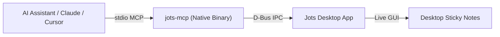

# Jots User Guide

Welcome to Jots! Jots is a lightweight, distraction-free sticky notes application for Linux designed to stay out of your way while keeping your thoughts, checklists, and code snippets organized.

---

## 📑 Table of Contents

* [1. Getting Started & Basic Note Taking](#1-getting-started--basic-note-taking)
* [2. Keyboard Shortcuts Cheat Sheet](#2-keyboard-shortcuts-cheat-sheet)
* [3. Typography & Font Customization](#3-typography--font-customization)
* [4. Markdown Formatting & Live Rendering](#4-markdown-formatting--live-rendering)
* [5. Themes & Appearance](#5-themes--appearance)
* [6. Preferences & Privacy Effects](#6-preferences--privacy-effects)
* [7. AI Assistant & MCP Integration](#7-ai-assistant--mcp-integration)
* [8. Markdown Storage, Backups & Tool Interoperability](#8-markdown-storage-backups--tool-interoperability)

---

## 1. Getting Started & Basic Note Taking

### Creating Notes
* Click the **`+`** button in the bottom-left action bar, or press **`Ctrl + N`**.
* Each note opens in its own lightweight desktop window that can be moved, resized, and arranged freely across your workspaces.

### Editing Note Titles
* Click the title label in the top bar to edit the note title.
* Press `Enter` or click outside to finish editing.

### Closing & Deleting Notes
* Click the **Trash** icon in the bottom-left action bar, or press **`Ctrl + W`**.
* The note is closed and removed from your active collection.

### Searching Notes
* Press **`Ctrl + F`** or **`Ctrl + Shift + F`** to open the interactive **Search Popover**.
* Start typing to search instantly across all active desktop windows and closed `.md` files on disk.
* Results display matching note titles, theme color pills, and extracted snippets with highlighted keyword matches.
* Use `Up`/`Down` arrow keys to navigate and press `Enter` to open or focus the matching note.

### Undoing Deletion (Restore)
* If you accidentally delete a note, press **`Ctrl + R`** immediately to restore the last deleted note with all its contents, theme, and window dimensions intact.

---

## 2. Keyboard Shortcuts Cheat Sheet

| Shortcut | Action | Description |
| :--- | :--- | :--- |
| **`Ctrl + N`** | **New Note** | Opens a new sticky note window with a fresh random color theme. |
| **`Ctrl + F`** / **`Ctrl + Shift + F`** | **Search Notes** | Opens the live full-text search popover across active and stored notes. |
| **`Ctrl + W`** | **Delete Note** | Deletes and closes the currently focused note window. |
| **`Ctrl + R`** | **Restore Note** | Undoes the last deletion and reopens the deleted note. |
| **`Shift + F12`** | **Toggle List** | Toggles list item prefix on the current line or selection. |
| **`Ctrl + M`** | **Toggle Monospace** | Switches between proportional and fixed-width monospace font. |
| **`Ctrl + T`** | **Toggle Action Bar** | Hides or reveals the bottom formatting and color toolbar. |
| **`Ctrl + H`** | **Toggle Scribbly Effect** | Toggles the handwritten blur/scribble privacy effect on unfocused notes. |
| **`Ctrl + .`** | **Insert Emoji** | Opens the native emoji picker popup. |
| **`Ctrl + G`** / **`Ctrl + O`** | **Note Preferences** | Opens the theme color palette and monospace font popover. |
| **`Ctrl + +`** / **`Ctrl + =`** | **Zoom In** | Increases the text size of the note. |
| **`Ctrl + -`** | **Zoom Out** | Decreases the text size of the note. |
| **`Ctrl + 0`** | **Reset Zoom** | Resets text zoom to the default 100% scale. |
| **`Ctrl + Scroll`** | **Smooth Zoom** | Scales text size dynamically using mouse scroll wheel or touchpad pinch. |
| **`Ctrl + Click`** | **Open Link** | Opens a detected URL or email address in your default web browser or mail app. |
| **`F1`** | **Quick Cheat Sheet** | Opens, presents, or restores the built-in indestructible quick reference Cheat Sheet note. |

---

## 3. Typography & Font Customization

Jots gives you full control over typography with dedicated settings for general text and code elements:

* **General Note Font**: Choose your preferred font family and size (e.g. *Inter*, *Cantarell*, *Ubuntu*, *Roboto*) used across proportional sticky notes.
* **Code & Monospace Font**: Choose your preferred fixed-width font family and size (e.g. *JetBrains Mono*, *Fira Code*, *Hack*, *Monospace*) used for inline code spans, code fences, and full-monospace notes.
* **Strict Monospace Filtering**: When selecting a code font in Preferences, the font chooser dialog automatically filters the system font catalog to strictly show only fixed-width monospace typefaces.
* **Instant Live Updates**: Changing font preferences updates all open sticky note windows instantly across the desktop without restarting the app.

---

## 4. Markdown Formatting & Live Rendering

Jots features a native, real-time Markdown rendering buffer (`MarkdownBuffer`) that highlights and styles Markdown syntax live as you type without distracting modal preview modes:

| Markdown Syntax | Example | Rendered Behavior |
| :--- | :--- | :--- |
| **Headings** | `# Heading 1`<br>`## Heading 2`<br>`### Heading 3` | Scaled typography (H1 140% bold, H2 120% bold, H3 110% bold) with subtle header delimiters. |
| **Bold & Strong** | `**bold text**` | Styled with heavy font weight. |
| **Italic & Emphasis** | `*italic text*` | Styled with slanted font style. |
| **Strikethrough** | `~~deleted text~~` | Rendered with a horizontal strikethrough line. |
| **Task Lists** | `- [ ] Pending item`<br>`- [x] Completed task` | Formatted with hanging list indent; typing `[x]` automatically applies strikethrough and muted tones to completed tasks. |
| **Smart Lists** | `• Item`<br>`- Item` | Automatic hanging indentation, Enter continuation, and Backspace list exiting. |
| **Blockquotes** | `> Important quote` | Italicized with a muted blockquote tone. |
| **Inline Code** | `` `const x = 42;` `` | Styled with a rounded highlight pill and dedicated monospace font. |
| **Code Fences** | ```` ```sh ````<br>`echo "Hello"`<br>```` ``` ```` | Multi-line code container rendered with monospace font and subtle background tint. |
| **Clickable Links** | `https://example.com`<br>`[Title](https://...)` | Detected and styled as links. **`Ctrl + Click`** opens the URL in your default browser. |

---

## 5. Themes & Appearance

### 10 Pastel Color Themes
Jots comes with 10 carefully designed pastel color palettes that adapt seamlessly to both Light and Dark system modes:

| Color Theme | Mood / Accent |
| :--- | :--- |
| **🫐 Blueberry** | Calm Blue *(Default first-run theme)* |
| **🍃 Mint** | Refreshing Green |
| **🍋 Lime** | Vibrant Yellow-Green |
| **🍌 Banana** | Warm Yellow |
| **🍊 Orange** | Energetic Amber |
| **🍓 Strawberry** | Soft Rose |
| **🍬 Bubblegum** | Playful Pink |
| **🍇 Grape** | Rich Purple |
| **🍫 Cocoa** | Earthy Brown |
| **🪨 Slate** | Minimal Neutral Gray |

* To change a note's theme, click the **Menu button** (three horizontal lines / menu icon in the bottom-right corner) or press **`Ctrl + G` / `Ctrl + O`** to open the note preferences popover, then select your desired color pill.
* New notes automatically pick a non-repeating random pastel theme to keep your desktop colorful.

### Monospace Code Mode (`Ctrl + M`)
* Press **`Ctrl + M`** to instantly toggle the entire note between proportional and fixed-width **Monospace font**.

---

## 6. Preferences, Privacy & Note Protection

Access global preferences by right-clicking a note or selecting **Preferences** from the app menu:

* **Scribbly Privacy Mode (`Ctrl + H`)**: When enabled, any note window that loses desktop focus immediately obfuscates its text and code elements with playful handwritten squiggles using the embedded `Redacted Script` typeface. Focusing the note instantly restores crystal-clear readable text.
* **Lock Note (Read-Only)**: Open the note popover menu (**`Ctrl + G`**) and toggle **Lock Note (Read-Only)** to protect sensitive or reference notes from accidental keyboard edits and title modifications.
* **Always Visible (Privacy Exemption)**: Toggle **Always Visible** in a note's popover menu to exempt that specific sticky note from Scribbly privacy obfuscation, keeping reference checklists or guides crisp and legible even when unfocused.
* **Built-in Quick Cheat Sheet (`F1`)**: Jots includes a built-in, read-only, privacy-exempt reference note with standard shortcuts and syntax tips. Press **`F1`** anytime to summon it, bring it to the front, or recreate it if closed.
* **Hide Action Bar (`Ctrl + T`)**: Hides the bottom toolbar on note windows to maximize writing space.
* **Autostart on Login**: Integrates with your desktop portal to automatically relaunch all your open sticky notes when you log into your computer.
* **Import from Jorts Migration Helper**: Seamlessly import your existing sticky notes from Jorts (`io.github.elly_code.jorts`). The import is **100% non-destructive**—your original Jorts `saved_state.json` file is never deleted or altered. You can trigger migration from the first-run prompt or anytime via the **Import from Jorts** button in Preferences.

---

## 7. AI Assistant & MCP Integration

Jots includes a native [Model Context Protocol (MCP)](https://modelcontextprotocol.io/) server (`jots-mcp`) allowing AI assistants (Claude Desktop, Cursor, Gemini CLI, and Antigravity) to read, create, search, and update your sticky notes in real time.



### Quick Client Setup

#### Claude Desktop (AppImage)
```json
{
  "mcpServers": {
    "jots": {
      "command": "/path/to/Jots-x86_64.AppImage",
      "args": ["--mcp"]
    }
  }
}
```

#### Claude Desktop (Flatpak)
```json
{
  "mcpServers": {
    "jots": {
      "command": "flatpak",
      "args": ["run", "--command=jots-mcp", "io.github.comicdeed.jots"]
    }
  }
}
```

#### Cursor (`.cursor/mcp.json`)
```json
{
  "mcpServers": {
    "jots": {
      "command": "/path/to/Jots-x86_64.AppImage",
      "args": ["--mcp"]
    }
  }
}
```
*(Note: If using Flatpak, pass `"command": "flatpak"` and `"args": ["run", "--command=jots-mcp", "io.github.comicdeed.jots"]`)*

### Available AI Tools
* **`list_notes`**: Returns an overview of all open desktop sticky notes with titles, themes, and word counts.
* **`read_note(id)`**: Reads the complete body text and properties of a specific note.
* **`create_note(title, content, theme)`**: Spawns a new sticky note window live on your desktop.
* **`update_note(id, title, content, theme)`**: Updates an open note's text, title, or theme color in real time.
* **`delete_note(id)`**: Closes and deletes a sticky note.
* **`search_notes(query)`**: Searches note titles and body content case-insensitively.

---

## 8. Markdown Storage, Backups & Tool Interoperability

### Native Markdown File Storage
Jots persists every sticky note as a separate, human-readable `.md` Markdown file containing standardized YAML front-matter headers:

```markdown
---
id: "3ba7ca8a-d40c-45b9-a9f8-94c15b853e2d"
title: "Project Ideas"
theme: "MINT"
monospace: false
zoom: 100
width: 380
height: 320
---
# Architecture Overview
- [x] Switch to Markdown storage
- [ ] Implement full-text search popover
```

### Storage Locations

* **Flatpak Sandbox (Development Build)**:
  ```text
  ~/.var/app/io.github.comicdeed.jots.devel/data/io.github.comicdeed.jots.devel/notes/
  ```
* **Flatpak Sandbox (Release Build)**:
  ```text
  ~/.var/app/io.github.comicdeed.jots/data/io.github.comicdeed.jots/notes/
  ```
* **Native / System Package**:
  ```text
  ~/.local/share/io.github.comicdeed.jots/notes/
  ```

### External Markdown Tools & Interoperability
Because notes are saved directly as plain `.md` files with standard YAML front-matter headers:
* You can potentially point external note-taking tools or vaults (such as **Obsidian** or **Logseq**) to your Jots notes directory to read and edit notes across applications.
* You can easily version control your notes with `git` or synchronize them with Syncthing / Nextcloud.
* Automatic migration ensures any legacy `saved_state.json` file from older Jots releases is automatically converted into separate `.md` files upon startup without losing data.
