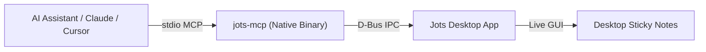

# Jots User Guide

Welcome to Jots! Jots is a lightweight, distraction-free sticky notes application for Linux designed to stay out of your way while keeping your thoughts, checklists, and code snippets organized.

---

## 📑 Table of Contents

* [1. Getting Started & Basic Note Taking](#1-getting-started--basic-note-taking)
* [2. Keyboard Shortcuts Cheat Sheet](#2-keyboard-shortcuts-cheat-sheet)
* [3. Rich Text Editing & Smart Lists](#3-rich-text-editing--smart-lists)
* [4. Themes, Fonts & Appearance](#4-themes-fonts--appearance)
* [5. Preferences & Visual Effects](#5-preferences--visual-effects)
* [6. AI Assistant & MCP Integration](#6-ai-assistant--mcp-integration)
* [7. Data Storage, Backups & Migration](#7-data-storage-backups--migration)

---

## 1. Getting Started & Basic Note Taking

### Creating Notes
* Click the **`+`** button in the bottom-left action bar, or press **`Ctrl + N`**.
* Each note opens in its own lightweight desktop window that can be moved, resized, and arranged freely across your workspaces.

### Editing Note Titles
* Click the title label in the top bar to edit the note title.
* Press `Enter` or click outside to finish editing.

### Closing & Deleting Notes
* Click the **Trash** icon in the bottom-left action bar, or press **`Ctrl + W`**.
* The note is closed and removed from your active collection.

### Undoing Deletion (Restore)
* If you accidentally delete a note, press **`Ctrl + R`** immediately to restore the last deleted note with all its contents, theme, and window dimensions intact.

---

## 2. Keyboard Shortcuts Cheat Sheet

| Shortcut | Action | Description |
| :--- | :--- | :--- |
| **`Ctrl + N`** | **New Note** | Opens a new sticky note window with a fresh random color theme. |
| **`Ctrl + W`** | **Delete Note** | Deletes and closes the currently focused note window. |
| **`Ctrl + R`** | **Restore Note** | Undoes the last deletion and reopens the deleted note. |
| **`Shift + F12`** | **Toggle List** | Toggles list item prefix on the current line or selection. |
| **`Ctrl + M`** | **Toggle Monospace** | Switches between proportional and fixed-width monospace font. |
| **`Ctrl + T`** | **Toggle Action Bar** | Hides or reveals the bottom formatting and color toolbar. |
| **`Ctrl + H`** | **Toggle Scribbly Effect** | Toggles the blur/scribble privacy effect on unfocused notes. |
| **`Ctrl + .`** | **Insert Emoji** | Opens the native emoji picker popup. |
| **`Ctrl + G`** / **`Ctrl + O`** | **Note Preferences** | Opens the theme color palette and monospace font popover. |
| **`Ctrl + +`** / **`Ctrl + =`** | **Zoom In** | Increases the text size of the note. |
| **`Ctrl + -`** | **Zoom Out** | Decreases the text size of the note. |
| **`Ctrl + 0`** | **Reset Zoom** | Resets text zoom to the default 100% scale. |
| **`Ctrl + Scroll`** | **Smooth Zoom** | Scales text size dynamically using mouse scroll wheel or touchpad pinch. |
| **`Ctrl + Click`** | **Open Link** | Opens a detected URL or email address in your default web browser or mail app. |

---

## 3. Text Editing, Lists & Links

### Toggling Lists (`Shift + F12`)
* Click the **List icon** in the bottom action bar or press **`Shift + F12`** to turn the current line (or selected lines) into a list item.
* Jots automatically applies hanging indentation so multi-line list items align cleanly under the text.

### Continuing & Exiting Lists
* **Continue list**: Pressing **`Enter`** on any list item automatically starts the next line with a list prefix.
* **Exit list**: Pressing **`Backspace`** when a line contains only an empty list prefix removes the prefix and returns to normal text.

### List Prefix Styles (Preferences)
In global preferences, you can configure your default list prefix character:
* `• Bullet` *(Default)*
* `- Dash`
* `~ Wave`
* `. Dot`

When you change the prefix in preferences, existing list items in open notes update automatically to match your preferred style.

### Clickable Hyperlinks & Emails
* Any web URL (`https://...` or `http://...`) or email address (`user@example.com`) typed into a note is automatically detected and styled as a clickable link.
* Hold **`Ctrl` and click** the link to open it in your default system browser or mail client.

---

## 4. Themes, Fonts & Appearance

### 10 Pastel Color Themes
Jots comes with 10 carefully designed pastel color palettes that adapt seamlessly to both Light and Dark system modes:

| Color Theme | Mood / Accent |
| :--- | :--- |
| **🫐 Blueberry** | Calm Blue *(Default first-run theme)* |
| **🍃 Mint** | Refreshing Green |
| **🍋 Lime** | Vibrant Yellow-Green |
| **🍌 Banana** | Warm Yellow |
| **🍊 Orange** | Energetic Amber |
| **🍓 Strawberry** | Soft Rose |
| **🍬 Bubblegum** | Playful Pink |
| **🍇 Grape** | Rich Purple |
| **🍫 Cocoa** | Earthy Brown |
| **🪨 Slate** | Minimal Neutral Gray |

* To change a note's theme, click the **Menu button** (three horizontal lines / menu icon in the bottom-right corner) or press **`Ctrl + G` / `Ctrl + O`** to open the note preferences popover, then select your desired color pill.
* New notes automatically pick a non-repeating random pastel theme to keep your desktop colorful.

### Monospace Code Mode (`Ctrl + M`)
* Press **`Ctrl + M`** to instantly toggle the note between proportional and fixed-width **Monospace font**.
* Alternatively, click the **Menu button** in the bottom-right action bar and toggle the **Monospace** button inside the popover.
* Ideal for code snippets, JSON payloads, Markdown tables, and terminal outputs.

---

## 5. Preferences & Visual Effects

Access global preferences by right-clicking a note or selecting **Preferences** from the app menu:

* **Scribbly Effect (`Ctrl + H`)**: Obscures and blurs note contents whenever a note loses window focus, keeping private notes hidden from shoulder surfers.
* **Hide Action Bar (`Ctrl + T`)**: Hides the bottom toolbar on note windows to maximize writing space.
* **Autostart on Login**: Integrates with your desktop portal to automatically relaunch all your open sticky notes when you log into your computer.

---

## 6. AI Assistant & MCP Integration

Jots includes a native [Model Context Protocol (MCP)](https://modelcontextprotocol.io/) server (`jots-mcp`) allowing AI assistants (Claude Desktop, Cursor, Gemini CLI, and Antigravity) to read, create, search, and update your sticky notes in real time.



### Quick Client Setup

#### Claude Desktop (`~/.config/Claude/claude_desktop_config.json`)
```json
{
  "mcpServers": {
    "jots": {
      "command": "flatpak",
      "args": ["run", "--command=jots-mcp", "io.github.comicdeed.jots.devel"]
    }
  }
}
```

#### Cursor (`.cursor/mcp.json`)
```json
{
  "mcpServers": {
    "jots": {
      "command": "flatpak",
      "args": ["run", "--command=jots-mcp", "io.github.comicdeed.jots.devel"]
    }
  }
}
```

### Available AI Tools
* **`list_notes`**: Returns an overview of all open desktop sticky notes with titles, themes, and word counts.
* **`read_note(id)`**: Reads the complete body text and properties of a specific note.
* **`create_note(title, content, theme)`**: Spawns a new sticky note window live on your desktop.
* **`update_note(id, title, content, theme)`**: Updates an open note's text, title, or theme color in real time.
* **`delete_note(id)`**: Closes and deletes a sticky note.
* **`search_notes(query)`**: Searches note titles and body content case-insensitively.

### Example AI Prompts & Workflows

You can speak naturally to your AI assistant—it will automatically choose and chain the right tools:

* **Capture Action Items**:
  > *"Take the top 4 action items from this meeting discussion and create a Mint sticky note titled 'Sprint Priorities'."*
* **Add to Existing Notes**:
  > *"Add 'Book bullet train passes' to my vacation sticky note."*
  *(The agent automatically searches for your vacation note, reads its current contents, and appends the new item.)*
* **Search & Summarize**:
  > *"What do I currently have on my desktop notes regarding server deployments?"*
* **Save Code Snippets**:
  > *"Save these Docker compose commands into a Slate sticky note with monospace font."*

*(For detailed MCP configuration options and guardrail limits, see the [MCP Integration Guide](development/mcp-server.md).)*

---

## 7. Data Storage, Backups & Migration

### Automatic Debounced Saving
* You never need to manually save notes. Jots automatically saves all open notes to disk 900ms after you stop typing.
* Window positions, sizes, and zoom levels are preserved across reboots.

### Where Notes Are Saved

* **Flatpak Sandbox (Flathub / AppCenter)**:
  ```bash
  ~/.var/app/io.github.comicdeed.jots/data/io.github.comicdeed.jots/saved_state.json
  ```
* **Native / System Package**:
  ```bash
  ~/.local/share/io.github.comicdeed.jots/saved_state.json
  ```

### Backing Up Your Notes
To backup your sticky notes, copy the `saved_state.json` file to a safe location:
```bash
cp ~/.var/app/io.github.comicdeed.jots/data/io.github.comicdeed.jots/saved_state.json ~/jots-backup.json
```
To restore a backup, place your backup file back into the data directory while Jots is closed.
